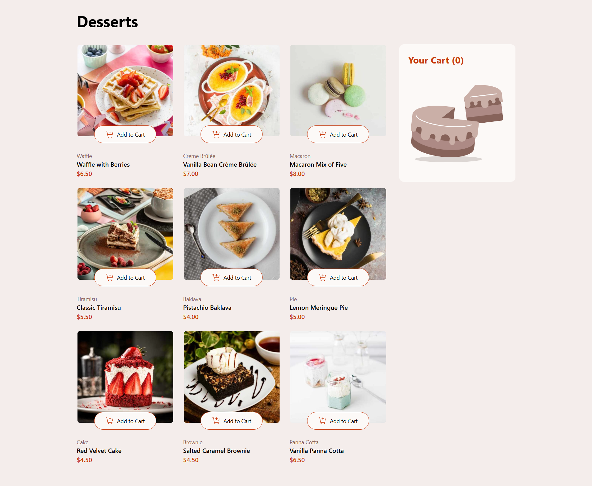

# Product list with cart

An interactive product listing page with add-to-cart functionality and dynamic quantity updates.



## Features

Users are able to:

- Add items to the cart and remove them
- Increase/decrease the number of items in the cart
- See an order confirmation modal when they click "Confirm Order"
- Reset their selections when they click "Start New Order"
- Navigate the whole project and perform all actions using only their keyboard
- View the optimal layout for the interface depending on their device's screen size
- See hover and focus states for all interactive elements on the page

## Technologies used

- REACT
- TAILWIND

## Getting Started

To run this project locally, follow these steps:

1. Clone the repository:
   ```bash
   git clone https://github.com/Davichobits/product-list-with-cart.git
   ```  
2. Navigate to the project directory:
   ```bash
   cd product-list-with-cart
   ```
3. Install the dependencies:
   ```bash
   npm install
   ```
4. Start the development server:
   ```bash
   npm run dev
   ```

## Author

David Ruiz - Frontend Developer
- [Github](https://github.com/Davichobits)
- [Frontend Mentor](https://www.frontendmentor.io/profile/Davichobits) 
- [Linkedin](https://www.linkedin.com/in/davidirc/)
- [YouTube](https://www.youtube.com/CodingTube)
- [codingtube.dev](https://codingtube.dev/)

## GitAds Sponsored
[](https://gitads.dev/v1/ad-track?source=davichobits/davichobits@github)

